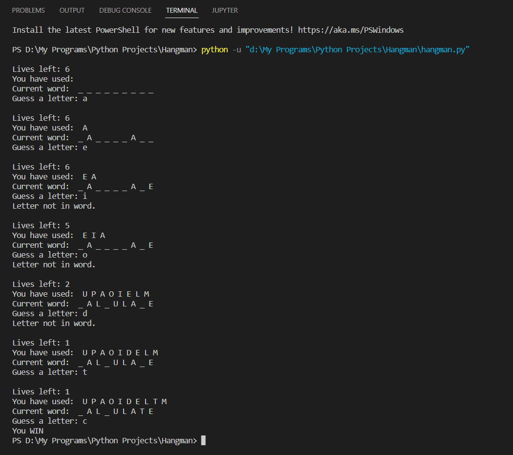

# Python-Projects
Some real world projects using Python.

## 1. Interactive Dictonary
**Just type the word and the program will give you the meaning from the dictonary.**

## 2. Website Blocker
**This program can be used for blocking websites for some time period**.
**It can be scheduled in the Task Schedular of your system and used in real**.

## 3. Book Store
**It uses sqlite3 for backend database.**

## 4. Hangman Game
**A simple hangman game that can be playes in terminal.**

## 5. Sudoku Solver
**It uses the concept of recursion and backtracking.**

## 6. Simple Calculator
**A GUI based calculator build using tkinter.**

## 7. Text Editor
**A GUI based text editor build using tkinter.**
**It can perform basic functionalities like opening, creating or saving a file.**
**You can also change color of the font.**

         
